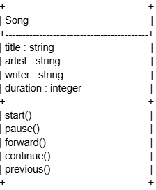

# SG4 - Understanding Classes and Objects
## Song
## This class represents a song from a musician in the context of music.
## Properties
| Property | Data Type | Description |
|---|---|---|
|title |string |Title of the song |
|artist |string |Artist who sung or performed the song |
|writer |string |Writer who wrote the song |
|duration |integer |The duration or length of song. |

## Methods
| Method | Description |
|---|---|
|start()|Plays the song |
|pause() |Pauses or stops the song |
|continue() |Continues the song if it is paused|
|forward() |Skips forward x amount of seconds into the song|
|previous() |Skips backward y amount of seconds into the song|

## Class Diagram

## Design Explanation
### Why did you choose this class?
I chose this class because ever since I was a kid, me and my whole family always loved music.
### Which property is the most important? Why?
The property most important is the title of the song. Without the title of the song, there would be confusion in differentiating two songs of similar or same properties.
### Which method is the most useful? Why?
Play would be the most important method because you cannot have music unless you play it. Without it, the song would not be able to be play or start.
