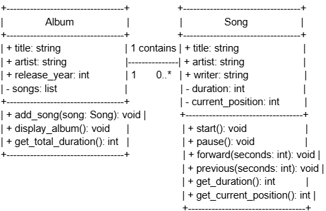
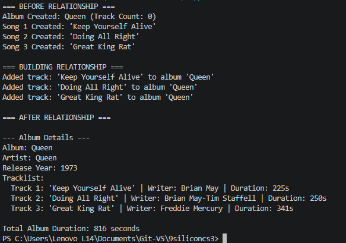
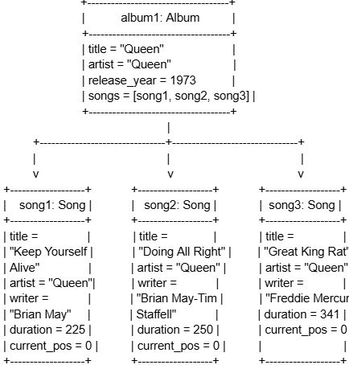

# Class Relationships: Association and Multiplicity
## Previous Work

[Part I - Classes and Objects](classObjectUML.md)
[Part II - Class Attributes and Methods](classAttributesMethods.md)

## Existing Class
Class: Song
Description: Represents a music track.

## New Related Class
Class: Album
Description: Represents an official music album released by an artist. It is an organization or list of multiple Song classes.

## Association
Relationship: Album contains a Song
Explanation: It has a direct association because it acts as a container that groups individual songs.

## Multiplicity
Multiplicity: 1 : many
Explanation: An Album can contain 0 or more Song classes. It is put in a list to allow an album to hold track references, while Song objects can still exist as an independent entity.

## UML Class Relationship Diagram

## Python Implementation
[View Python Source](classRelationships.py)

## Test Run

## Object Relationship Diagram

## Analysis
### What is the association between your two classes?
The association of Album and Song is a "HAS-a" relationship because Album contains and manages 0- Many Song objects. The Album is like a structure that contains related tracks together. It doesn't replace the class Song, but it instead uses direct object references to obtain attributes and methods of each song.
### What multiplicity did you choose and why?
I chose one to many (1 to 0..*) multiplicity. This is appropriate for the use case because an album can start with zero or miltiple songs in their tracklist. On the other hand, each Song instance is an individual track and can be added to the album.
### How did you implement the relationship in Python?
I implemented the relationship by making a private list called self.songs = [] inside the Album__init__ method. The add_song() method takes the Song object as an argument and appends to self.songs. This allows it to maintain a collection of song references.
### Why did you store an object reference instead of copying its data?
Storing an object reference ensures consistent data and can allow functional interaction between objects. If only string values like song titles were appended, the Album wouldn't be able to execture methods on the original songs. Using references allows the Album to directly call methods on live objects. 
### If your relationship uses many, why is a list appropriate?
A python list is appropriate because it is dynamic and can handle multiple items. Lists can preserve track sequence, which reflects how an album can play tracks in order. Additionally, a list cab iterate through each Song using loops to calculate totals and display metadata.